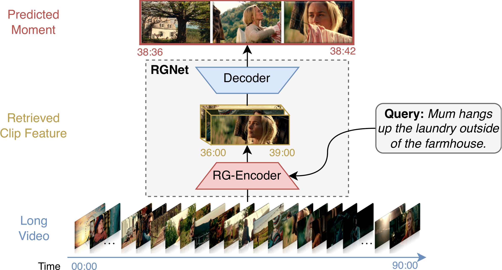
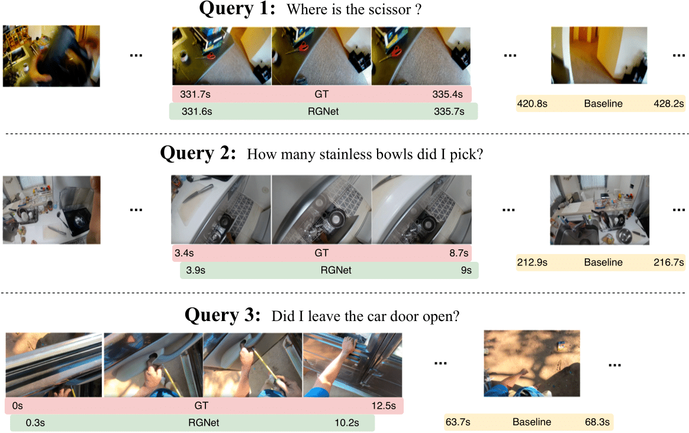

# RGNet
[RGNet: A Unified Clip Retrieval and Grounding Network for Long Videos](https://arxiv.org/pdf/2312.06729) 

Tanveer Hannan Md Mohaiminul Islam Thomas Seidl Gedas Bertasius

Accepted by **ECCV 2024**

[[Website](https://sites.google.com/view/rgnet)] [[Paper](https://arxiv.org/pdf/2312.06729)]

[//]: # (Official PyTorch implementation of the paper "RGNet: A Unified Clip Retrieval and Grounding Network for Long Videos".)


[](https://paperswithcode.com/sota/natural-language-queries-on-ego4d?p=rgnet-a-unified-retrieval-and-grounding)

[](https://paperswithcode.com/sota/natural-language-moment-retrieval-on-mad?p=rgnet-a-unified-retrieval-and-grounding)

---

## :loudspeaker: Latest Updates
- **Jul-13**: The trained models weights are available [here](https://drive.google.com/drive/folders/1y5QSCLQKpKy2cBuflefWvOhrb5ysDLry?usp=share_link) 
- **Jul-13**: Released the training and evaluation code.
- **Jul-1**: RGNet is accepted to ECCV 2024! :fire::fire:
---

## RGNet Overview :bulb:

RGNet is a novel architecture for processing Long Videos (20–120 minutes) for fine-grained video moment understanding and reasoning. 
It predicts the moment boundary specified by textual queries from an hour-long video. 
RGNet unifies retrieval and moment detection into a single network and processes long videos into multiple granular levels, e.g., clips and frames. 

[//]: # (![framework]&#40;images/main.png&#41;)


---

## Contributions :trophy:

- We systematically deconstruct existing LVTG methods into clip retrieval and grounding stages. Through empirical evaluations, we discern that disjoint retrieval is the primary factor contributing to poor performance.
- Based on our observations, we introduce RGNet, which integrates clip retrieval with grounding through parallel clip and frame-level modeling. This obviates the necessity for a separate video retrieval network, replaced instead by an end-to-end clip retrieval module tailored specifically for long videos.
- We introduce sparse attention to the retriever and a corresponding loss to model fine-grained event understanding in long-range video. We propose a contrastive negative clip-mining strategy to simulate clip retrieval from a long video during training.
- RGNet surpasses prior methods, showcasing state-of-the-art performance on long video temporal grounding (LVTG) datasets MAD and Ego4D.


---

## Installation :wrench:
* Follow [INSTALL.md](./INSTALL.md) for installing necessary dependencies and compiling the code.

### Prepare-offline-data
- Download full Ego4D-NLQ data [Ego4D-NLQ](https://drive.google.com/file/d/1QsG7Jp8tYjisvZkMZiB5r1stAsVo86EY/view?usp=sharing) (8.29GB).
- Download partial MAD data [MAD](https://drive.google.com/file/d/1DYX_rXn0mjiAx36sdsF3W14D--3XnMQB/view?usp=sharing) (6.5GB). We CAN NOT share the MAD visual features at this moment, please request access to the MAD dataset from official resource [MAD github](https://github.com/Soldelli/MAD).
- We provide the feature extraction and file pre-processing procedures for both benchmarks in detail, please refer to [Feature_Extraction_MD](./feature_extraction/README.md).
- Follow [DATASET.md](./data/DATASET.md) for processing the dataset. 

### Ego4D-NLQ-training
Training can be launched by running the following command. The checkpoints and other experiment log files will be written into `results`.
```
bash rgnet/scripts/pretrain_ego4d.sh 
bash rgnet/scripts/finetune_ego4d.sh
```

#### Ego4D-NLQ-inference
Once the model is trained, you can use the following commands for inference, where `CHECKPOINT_PATH` is the path to the saved checkpoint.
```
bash rgnet/scripts/inference_ego4d.sh CHECKPOINT_PATH 
```


### MAD-training
Training can be launched by running the following command:
```
bash rgnet/scripts/train_mad.sh 
```

#### MAD-inference
Once the model is trained, you can use the following commands for inference, where `CUDA_DEVICE_ID` is cuda device id, `CHECKPOINT_PATH` is the path to the saved checkpoint.
```
bash rgnet/scripts/inference_mad.sh CHECKPOINT_PATH 
``` 

## Qualitative Analysis :mag:

A Comprehensive Evaluation of RGNEt's Performance on Ego4D-NLQ Datasets.

[//]: # (![0]&#40;images/qual.png&#41; )


---


## Acknowledgements :pray:

We are grateful for the following awesome projects our VTimeLLM arising from:

* [Moment-DETR](https://github.com/jayleicn/moment_detr): Detecting Moments and Highlights in Videos via Natural Language Queries
* [QD-DETR](https://github.com/wjun0830/QD-DETR): Query-Dependent Video Representation for Moment Retrieval and Highlight Detection 
* [CONE](https://github.com/mbzuai-oryx/Video-ChatGPT): An Efficient COarse-to-fiNE Alignment Framework for Long Video Temporal Grounding
* [MAD](https://github.com/Soldelli/MAD): A Scalable Dataset for Language Grounding in Videos from Movie Audio Descriptions
* [Ego-4D](https://github.com/EGO4D/episodic-memory): Ego4D Episodic Memory Benchmark

If you're using VTimeLLM in your research or applications, please cite using this BibTeX:
```bibtex
@article{hannan2023rgnet,
  title={RGNet: A Unified Retrieval and Grounding Network for Long Videos},
  author={Hannan, Tanveer and Islam, Md Mohaiminul and Seidl, Thomas and Bertasius, Gedas},
  journal={arXiv preprint arXiv:2312.06729},
  year={2023}
}
```

## License :scroll:
<a rel="license" href="https://creativecommons.org/licenses/by-nc-nd/4.0/"></a> 

This work is licensed under a <a rel="license" href="http://creativecommons.org/licenses/by-nc-nd/4.0/">Creative Commons Attribution-NonCommercial-NoDerivs 4.0 International License</a>.


Looking forward to your feedback, contributions, and stars! :star2:
